#第6次作业
#conf包
数据库配置文件
#controller包
login.go关于登录的控制器函数

message.go关于留言的控制器函数

register.go关于注册的控制器函数

#middle包
登录前的中间件，判断是否是带入Answer登录(Answer即密保答案)

###lv2:登录注册plus
####注册
```go
//注册时携带密保及答案进行注册
registerRouter.POST("/",controller.Register)//注册账户
```
Postman测试
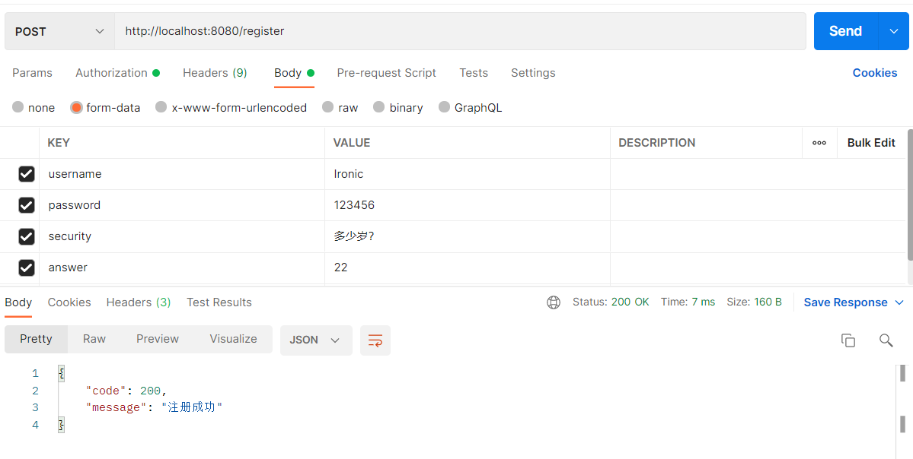
数据库表呈现
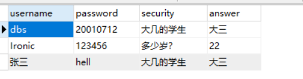
####登录(通过设置cookies登录)
```go
//携带密保答案的登录
loginRouter.POST("/",middle.LoginMiddle(),controller.Login)//登录
```
Postman测试
①当密码输入正确时
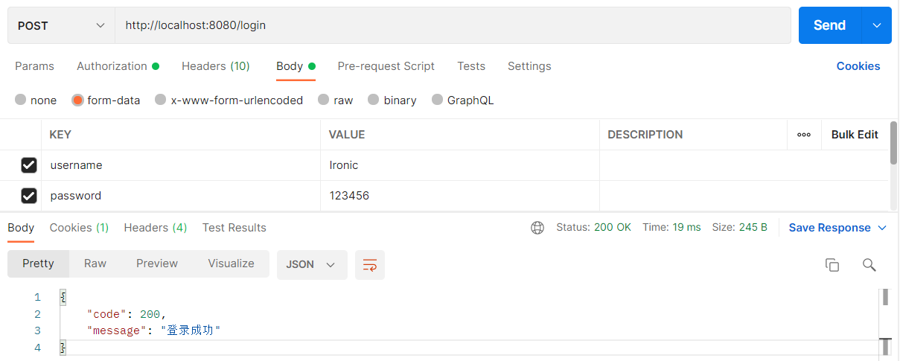
②当密码输入错误时
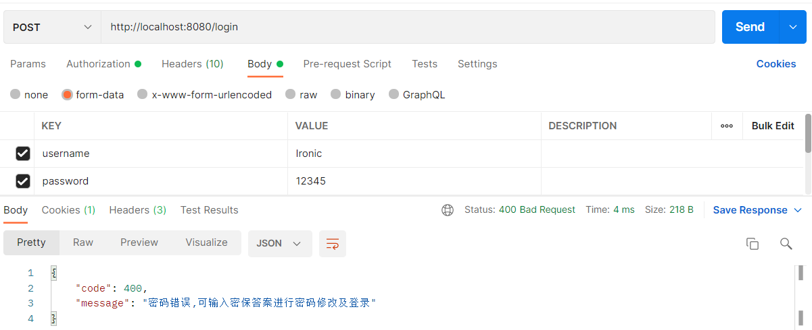
③密码错误输入密保答案进行登录，且修改密码
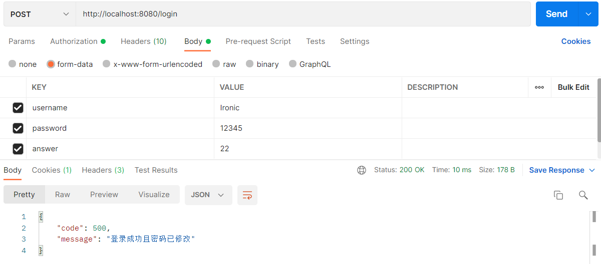
④此时的数据库表(密码已经被修改)
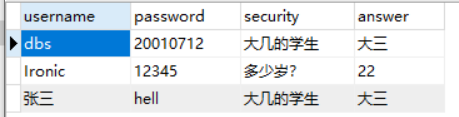
####退出登录
```go
loginRouter.GET("/",controller.CancelLogin)//注销登录
```
Postman测试
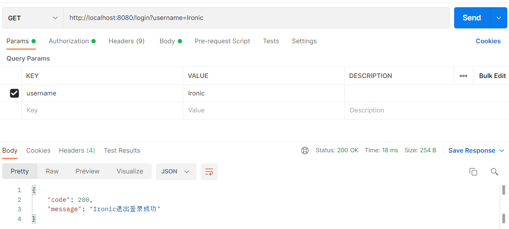
####设置留言
通过登录时设置的cookie来使用户对其他人(包括自己)进行留言
```go
loginRouter.POST("/message",controller.SetMessage)//设置留言
```
Postman测试
①当无用户登录时，即不存在cookie时
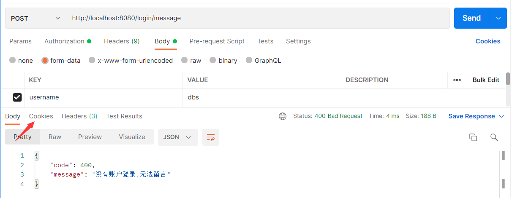
②当用户登录时，对其他人留言
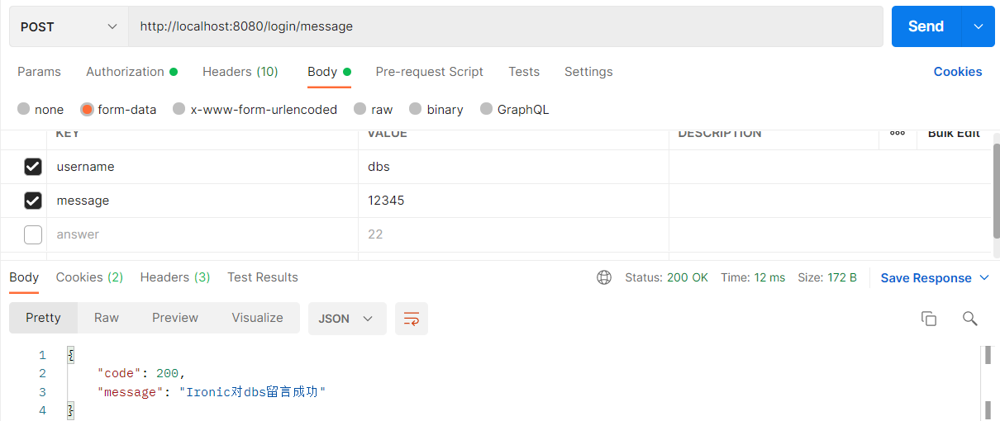
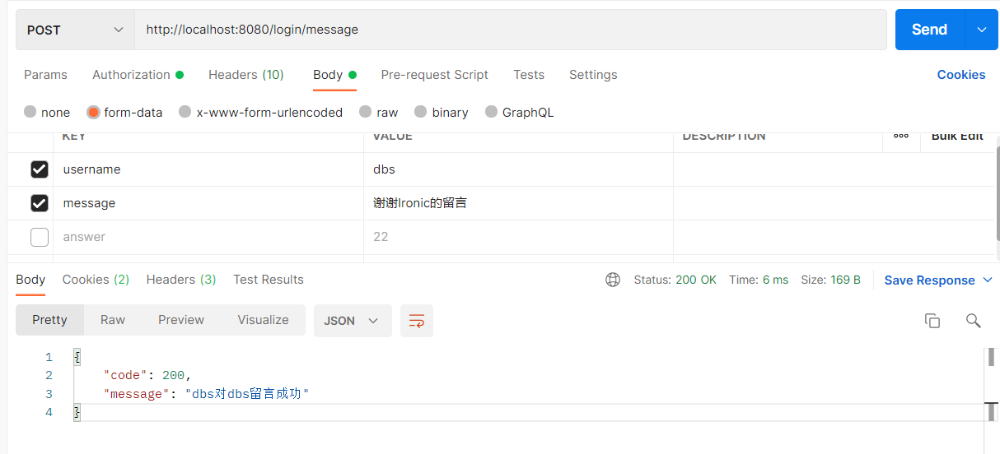
####查看自己的留言
```go
loginRouter.GET("/message",controller.GetMessage)//获取本账户留言
```
Postman测试
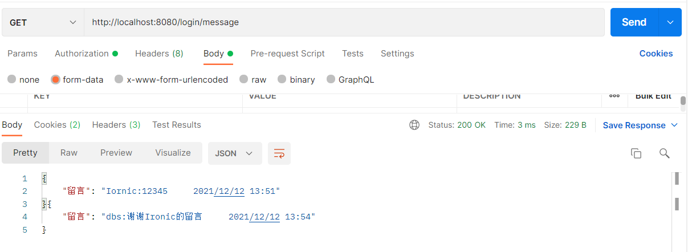